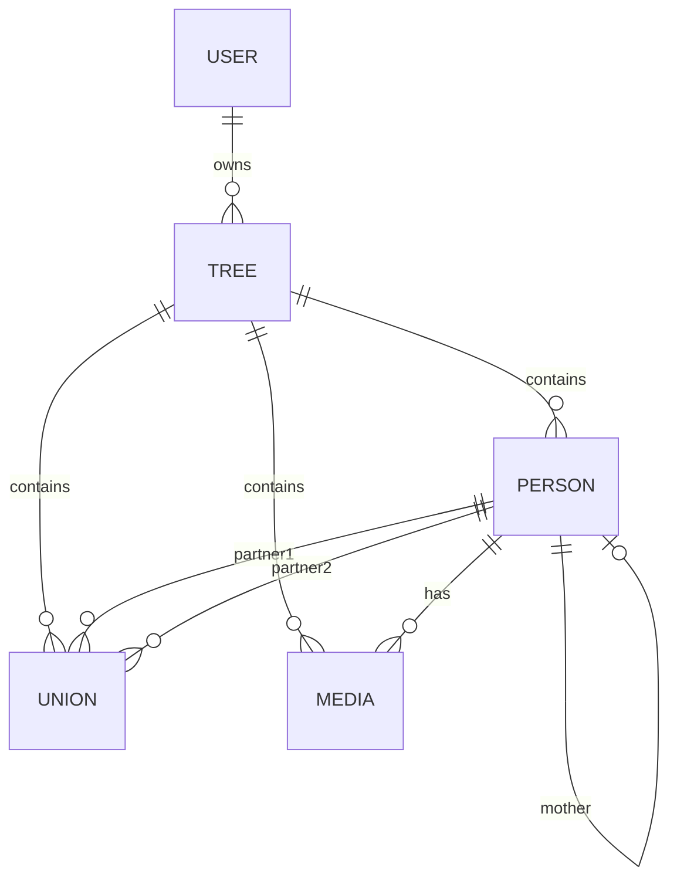

# Architecture & Technical Design 🏗️

This page provides an overview of the technical architecture of **Ancestors**, detailing our data modeling, framework choices, and optimization decisions.

---

## 📂 Project Structure

Ancestors is a monolithic **Next.js 16 (App Router)** application. This choice minimizes infrastructure complexity by housing both the front-end interface and the back-end API routes inside a single unified repository.

```text
ancestors/
├── prisma/
│   ├── migrations/            # Relational database migration scripts
│   └── schema.prisma          # Database schema definition (SQLite)
├── src/
│   ├── app/
│   │   ├── api/               # Serverless API routes (JSON endpoints)
│   │   │   ├── auth/          # JWT Session and OAuth 2.0 FamilySearch endpoints
│   │   │   ├── people/        # Indviduals management, search, and Smart Merge
│   │   │   └── search/        # Public API proxies (MatchID, FamilySearch)
│   │   ├── people/            # Directory, profiles, and Smart Merge client pages
│   │   ├── tree/              # Figma-like Interactive Tree Client page
│   │   └── globals.css        # Core stylesheet and active haptic click feedback
│   ├── components/            # Reusable React components (Modals, place pickers)
│   ├── lib/
│   │   ├── auth.ts            # Password hashing, JWT signing, and active tree verification
│   │   └── db.ts              # Global Prisma Client instance
│   └── utils/
│       ├── consistency.ts     # Chronological warning algorithms
│       └── dateParser.ts      # Year extractor and fuzzy date parser
```

---

## 💾 Relational Data Modeling

We utilize **Prisma ORM** over a **SQLite** database. This offers two massive advantages:
1.  **Strict Relationships**: Ensuring children cannot be linked to missing parents, and media remains attached to existing individuals.
2.  **Single-File Portability**: Backing up the entire application database is as simple as copying the `dev.db` file.



### 1. Multi-Tree Scoping
Every model (`Person`, `Union`, `Media`) is linked to a specific `Tree` via a `treeId` column. When a user requests data, the API systematically extracts their active tree from secure cookies and scopes all Prisma queries to `treeId`, ensuring complete data isolation between different trees.

### 2. Self-Referential Parentage
Instead of a separate relational table for parents, the `Person` model references itself:
```prisma
model Person {
  id             String    @id @default(uuid())
  firstName      String
  lastName       String
  // ...
  fatherId       String?
  motherId       String?
  father         Person?   @relation("FatherOf", fields: [fatherId], references: [id], onDelete: SetNull)
  mother         Person?   @relation("MotherOf", fields: [motherId], references: [id], onDelete: SetNull)
  
  fatherOf       Person[]  @relation("FatherOf")
  motherOf       Person[]  @relation("MotherOf")
}
```
This self-referential loop makes parent traversal extremely fast.

### 3. Unions and Partnerships
Marriages and partnerships are modeled via a separate `Union` entity. A Union connects `partner1Id` and `partner2Id` to the `Person` model, recording the union type, wedding date, wedding place, and divorce status. This cleanly handles multi-spouse lineages and non-traditional family structures.

---

## 📅 Chronological Validation and Date Parsing

In genealogy, dates are rarely perfect (e.g., *"circa 1812"*, *"before 1888"*, *"approx. May 1750"*). 
*   **Fuzzy Date Parser (`utils/dateParser.ts`)**: Rather than standard `DateTime` columns (which would crash on incomplete dates), dates are stored as raw text strings. When retrieved or rendered, our custom parser extracts the year, month, and day, recognizing flags like "vers" (circa) or "avant" (before) to maintain user readability while enabling sorting.
*   **Consistency Engine (`utils/consistency.ts`)**: To prevent database degradation, a rule engine parses and validates chronology across relations before saving modifications, alerting users if they attempt to record a parent born *after* their child, or a death preceding birth.
